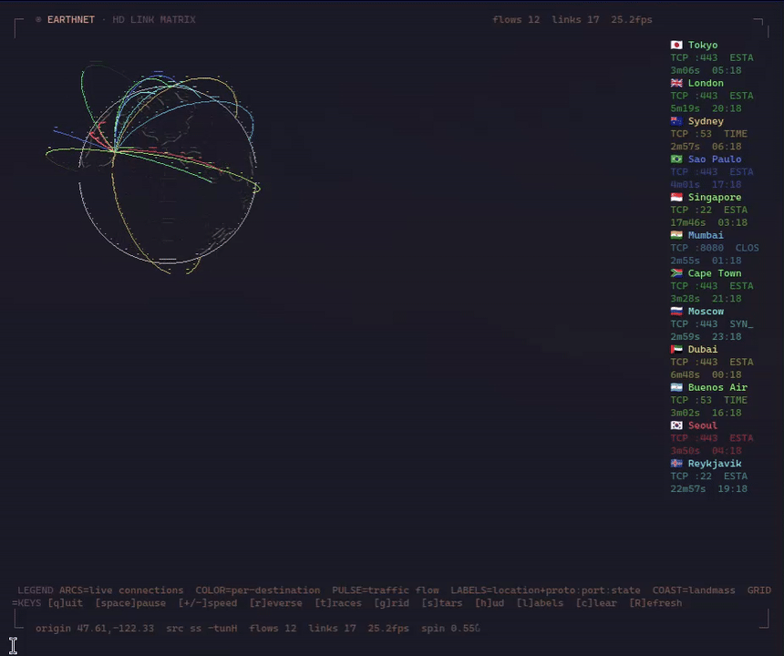

# earthnet

A translucent 3D Earth globe in your terminal, with glowing arcs tracing every live internet connection to and from your network. Jarvis-style HUD, in any truecolor terminal.



Pure Python standard library — no runtime dependencies.

## Install

**Arch Linux:**

```bash
yay -S earthnet            # from the AUR (once published)
# or build locally:
git clone https://github.com/zenwattage/Earthnet.git && cd Earthnet && makepkg -si
```

**Any distro:**

```bash
pipx install .            # or: pip install .
```

Optional — the HD sixel wireframe renderer (automatic when present):

```bash
sudo pacman -S python-numpy python-pillow
```

## Run

```bash
earthnet                  # live globe of your connections
earthnet --demo           # animated demo (the gif above)
```

The first run downloads ~1 MB of land data to `~/.cache/earthnet/`, geolocates your IP for "home", and starts the globe.

| key          | action                    |
|--------------|---------------------------|
| `q` / Ctrl-C | quit                      |
| `space` / `p`| pause rotation            |
| `+` / `-`    | spin faster / slower      |
| `r`          | reverse spin              |
| `t`          | toggle trace arcs         |
| `g`          | toggle lat/long graticule |
| `s`          | toggle starfield          |
| `h`          | toggle HUD                |
| `l`          | toggle destination labels |
| `c`          | clear all traces          |

## Options

```bash
earthnet --no-hd                 # force the text renderer (skip HD sixel)
earthnet --hd-res 540            # lower res = higher FPS
earthnet --hd-res 1200           # bigger, more detail (slower)
earthnet --inches 5              # fixed 5" globe instead of filling the window
earthnet --home 51.5074,-0.1278  # override your home coordinates
earthnet --mmdb ~/GeoLite2-City.mmdb   # offline GeoIP (no key needed to run)
```

HD mode (numpy + Pillow) renders a glowing wireframe globe at full pixel resolution via sixel. The palette follows your active Omarchy theme automatically; otherwise the built-in default is used. Without numpy/Pillow it falls back to the text renderer.

## Connections

Captures live flows in order: `conntrack -L` → `/proc/net/nf_conntrack` → `ss -tunH`. The first two need root; `ss` is an unprivileged fallback. To see whole-network traffic, run on your router/gateway:

```bash
sudo earthnet
```

GeoIP uses the free ip-api.com by default (cached). Use `--mmdb` for offline lookups — earthnet ships its own MMDB reader, no `geoip2` needed.