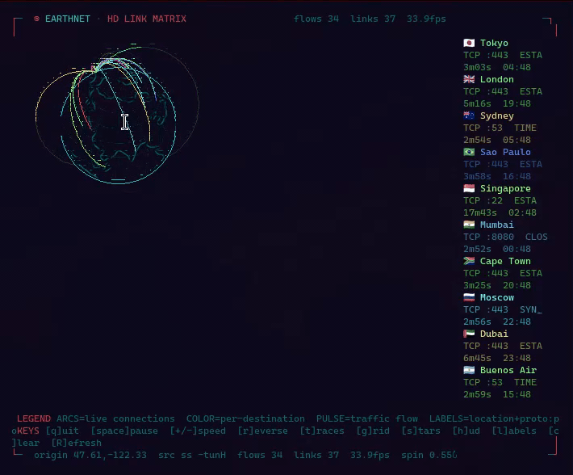

# earthnet
My first Vibe-Coded project. A Iron Man 'Jarvis-style' HUD-like spinning globe that shows all my network connections. In the terminal. 

The rest of this Readme was agent written other than a few edits by me:



A floating, translucent 3D globe of the Earth in your terminal, with glowing
great-circle arcs tracing every internet connection coming and going from your
network. Built for the **Foot** terminal (works in any truecolor terminal).

```
                 ┌──────────────────────────────────────────┐
                 │   animated arcs from you to each  │
                 │      live connection endpoint            │
                 └──────────────────────────────────────────┘
```

Pure Python standard library — **no pip, no dependencies**. Just run it.

## Quick start

```bash
cd earthnet
python3 -m earthnet
```

The first run downloads Natural Earth 110m land data (~1 MB) and caches it in
`~/.cache/earthnet/`. It then geolocates your public IP for "home", reads your
live connection table, and starts the globe.

Press `q` to quit. Full key bindings:

| key          | action                         |
|--------------|--------------------------------|
| `q` / Ctrl-C | quit                           |
| `space` / `p`| pause globe rotation           |
| `+` / `-`    | spin faster / slower           |
| `r`          | reverse spin                   |
| `t`          | toggle trace arcs              |
| `g`          | toggle lat/long graticule      |
| `s`          | toggle starfield               |
| `h`          | toggle HUD                     |
| `l`          | toggle destination labels      |
| `c`          | clear all traces               |

### High-definition sixel mode (full pixel resolution)

When **numpy** and **Pillow** are installed, earthnet automatically renders
the globe as a **TRON / Jarvis-HUD wireframe** and blits it with **sixel**
(Foot's pixel-image protocol). The globe is pure glowing lines on a transparent
background — the **sphere silhouette**, the **lat/long graticule**, and the
**coastline outlines** (landmasses are outlines, not solid fill) — in your
theme's grid color, with the front-side wireframe bright and the far-side dim so
the globe reads as a translucent sphere. Trace arcs are crisp laser lines
composited on top with a bright moving pulse showing live traffic flow, and are
occluded by the globe (no backside show-through).

The globe is **upright** (north up), **left-justified**, **centered on your
latitude** (the screen-center latitude is locked to your home latitude while
longitude rotates through), and fills the window height, with headroom reserved
above it so the arching trace arcs are clearly visible. Each visible destination
is **labeled with its national flag + city/country** (rendered as terminal text
in the arc's color, so flags show in color via Foot's emoji font); press `l` to
toggle. The **starfield is off by default** (press `s` to toggle). The Jarvis HUD chrome (corner brackets, header, footer)
sits in the top/bottom margins. The sixel region is **explicitly erased and
redrawn each frame** (the previous sixel's cells are overwritten with spaces,
then the new sixel is blitted, all inside a synchronized update) — Foot doesn't
erase an old sixel on its own, so without this the lines would streak as the
globe spins. The screen is full-cleared only on resize. The wireframe lines are
**anti-aliased** (intensity falloff, so they fade smoothly instead of popping
between pixels); the land-coverage field is **blurred** before coastline edge
detection so coastlines stay smooth as the quantized landmask shifts under the
rotating globe; and colors are quantized to a **fixed palette** built once from
the theme colors (no per-frame adaptive quantization, no dithering) so colors
stay stable across frames. Together these give a clean rotation with minimal
flicker/jitter. For maximum sub-pixel smoothness use `--hd-ss 2` (renders at 2×
then downsamples) at the cost of a lower frame rate.

Install the two dependencies (one-time):

```bash
sudo pacman -S python-numpy python-pillow
```

Then just run as usual — HD is used automatically. If for some reason numpy or
Pillow is missing, the app falls back to the text renderer.

```bash
foot -W 80x30 python3 -m earthnet          # HD Jarvis widget
python3 -m earthnet --hd-res 540           # lower res = higher FPS
python3 -m earthnet --hd-res 1200          # bigger / more detail (slower)
python3 -m earthnet --hd-colors 64         # smaller output, faster
python3 -m earthnet --no-hd                # force the text renderer
```

The globe spins slowly, so ~6 fps at the default `--hd-res 960` reads as smooth
motion; drop `--hd-res` (or `--hd-colors`) for a higher frame rate or raise it
for a bigger, more detailed globe.

### Globe size — the Jarvis-HUD look

By default the globe **fills the window** edge-to-edge (no dead space, maximum
resolution) inside a sci-fi HUD frame: corner brackets, a `EARTHNET · LIVE
LINK MATRIX` header, a glassy `ACTIVE LINKS` telemetry panel listing each
endpoint, compass ticks (N/E/S/W) around the rim, and a status footer. It's
styled like the small globe + projected flight path in Iron Man's suit HUD.

For the compact widget look, just launch Foot small — the globe fills whatever
size you give it:

```bash
foot -W 76x30 python3 -m earthnet       # small Jarvis-style widget (chars)
foot -W 120x40 python3 -m earthnet      # larger, still no dead space
foot -w 760x600 python3 -m earthnet     # ...or size in pixels
```

Or pin a physical size instead of filling:

```bash
python3 -m earthnet --inches 5         # fixed 5" globe
python3 -m earthnet --pt-scale 1.05    # nudge inch sizing on your font
```

### High-definition rendering

- **Anti-aliased coastlines**: the land mask is built by 4× supersampling
  Natural Earth 110m land into a 0..255 coverage grid, so coasts blend smoothly
  instead of aliasing — at zero runtime cost.
- **Crisp trace lines**: arcs are fully lit along their whole path, drawn with a
  3×3 anti-aliased brush (~2-3 sub-pixels thick) and a bright moving packet
  head. Color is by protocol (cyan = tcp, amber = udp, magenta = other).
- **Half-block sub-pixels** (`▀`/`▄`/`█`) give 2× vertical resolution and smooth
  sphere shading. Arcs fade out a few seconds after a connection disappears.

Preview a single still frame without taking over your terminal:

```bash
python3 -m earthnet --demo | less -R
```

## How connections are captured

Three backends are tried in order:

1. **`conntrack -L`** — the kernel's live flow table. Sees every tracked
   TCP/UDP/ICMP flow on this box. **Needs root or `CAP_NET_ADMIN`.**
2. **`/proc/net/nf_conntrack`** — same data read directly. Also **root-only.**
3. **`ss -tunH`** — active sockets on this host only, **no root**. Used
   automatically as a fallback so the app is demoable unprivileged.

Without root you only see this machine's own sockets. To see *whole-network*
traffic (the original goal), run earthnet on your router/gateway where
conntrack sees every flow passing through, e.g.:

```bash
sudo python3 -m earthnet
```

or grant the capability once and skip sudo:

```bash
sudo setcap cap_net_admin+ep "$(command -v python3)"
```

> Note: `setcap` on the interpreter affects all Python scripts on the system.
> A safer route is a small wrapper binary, or just use `sudo`.

## GeoIP

By default earthnet uses the free **ip-api.com** batch endpoint (no key, ~45
lookups/min, results cached to `~/.cache/earthnet/geo.json`). That's plenty
for a home network's active flows.

For fully **offline** GeoIP, download a GeoLite2-City database and point the app
at it:

```bash
# MaxMind now requires a (free) license key:
#   https://www.maxmind.com/en/geolite2/signup
# Put GeoLite2-City.mmdb somewhere, then:
python3 -m earthnet --mmdb ~/GeoLite2-City.mmdb
```

earthnet includes its own tiny MMDB reader, so no `geoip2` package is needed.

Override your home location (e.g. if auto-detection is wrong or you want to
visualize from another vantage point):

```bash
python3 -m earthnet --home 51.5074,-0.1278
```

## Theming (matches your system theme)

earthnet reads your **active Omarchy theme** at startup and derives its entire
palette from it — background, ocean tint, land, graticule, trace arcs, and HUD
all follow your current theme colors. It looks at:

```
~/.local/state/omarchy/current/theme/colors.toml   (preferred)
~/.local/state/omarchy/current/theme/foot.ini      (fallback)
```

Change your theme the normal way and the globe follows on the next launch:

```bash
omarchy theme set catppuccin        # globe recolors to Catppuccin next run
omarchy theme set gruvbox           # ...etc
```

Outside Omarchy (or with no theme found), the built-in default palette is used.

You can preview exactly what palette earthnet computes from your theme:

```bash
python3 -m earthnet.theme
```

### Translucency

earthnet also reads the theme's background alpha (`background-alpha` in the
theme's `shell.toml`, or Foot's `[colors] alpha`) and matches it: the space
around the globe is never painted, so Foot's real (potentially translucent)
background — and the desktop behind it — shows through. The globe's rim blend
tightens to that alpha, so if you later set a translucent terminal the orb
floats glassily over your desktop.

## Recommended Foot settings

earthnet needs **24-bit color** and a reasonably sized window. Foot enables
truecolor by default and your Omarchy theme already configures the colors, so
you usually don't need to change anything. Optional tweaks in
`~/.config/foot/foot.ini`:

```ini
[tweak]
# smooth dense animated redraw
damage-whole-buffer=true
```

Then launch: `foot --app-id=earthnet python3 -m earthnet`.

## How it works

- **Globe**: reverse orthographic projection. For every sub-pixel inside the
  globe disk we compute the near *and* far surface points, rotate them back to
  geographic (lat, lon), look up a rasterized land mask, and blend a bright
  near surface over a dim far surface — so far-side continents show through the
  translucent ocean. Half-block characters (`▀`/`▄`/`█`) give ~square pixels.
- **Land**: Natural Earth 110m land GeoJSON, scanline-rasterized once into a
  0.5° land mask and cached.
- **Traces**: each connection endpoint is geolocated and drawn as a great-circle
  arc from your home location, lifted radially so long hops visibly bow over the
  globe, with an animated glowing "packet" head and a fading tail. Color is by
  protocol (cyan = tcp, amber = udp, magenta = other). Arcs fade out a few
  seconds after the connection disappears.

## Files

```
earthnet/
├── __main__.py   # entry point + CLI
├── app.py        # main loop: capture thread, animation, HUD, input, TTY
├── globe.py      # 3D math, projection, translucent renderer, trace arcs
├── land.py       # land-mask download + rasterize + cache
├── geo.py        # MMDB reader + ip-api fallback + home detection
├── conntrack.py  # conntrack / nf_conntrack / ss polling
└── theme.py      # reads the active Omarchy theme -> globe palette
```

## Notes / limitations

- ip-api free tier is HTTP-only and rate-limited; lookups are cached and batched
  so this rarely matters for a home network. Use `--mmdb` to avoid it entirely.
- For real transit/whole-network tracing, run on a router with conntrack (see
  above). On a workstation you see this host's flows.
- Performance: ~13 ms/frame at 80×40, ~21 ms at 180×50 on a typical machine —
  smooth at 30 fps.
