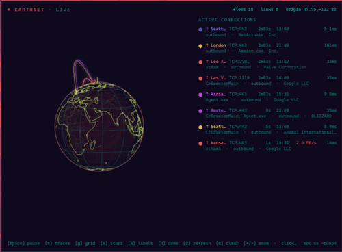

# Earthnet for the Omarchy bar

A live, full-resolution 3D Earth in your [Omarchy](https://omarchy.org/) status
bar — glowing arcs trace every internet connection to and from your machine.
This is the GUI sibling of the [terminal Earthnet](../README.md): same data,
same palette, same idea, but drawn in real pixels by Quickshell instead of
half-blocks and sixel.



The bar shows a small spinning Earth. Left-click it for the full panel: a large
animated globe, the Jarvis HUD, and a colour-matched legend of every live
connection. Each legend row shows the destination, protocol/port, how long
it's been open, the destination's local time, live throughput, and round-trip
latency; a second line carries the owning process, the flow direction
(`↑` you initiated, `↓` remote initiated, `↕` both), and the network operator
(ISP/org). So a row reads like *"↑ Tokyo  TCP:443  12s  04:21  3.8 MB/s  87ms
/ firefox · outbound · Amazon.com, Inc."*

Click a legend row to open a **connection detail card** for that link: remote
IP, location and coordinates, network/ISP and ASN, direction, protocol/port and
state, owning process and PID, number of underlying flows, live throughput,
total sent/received, latency, duration, and the destination's local time. Press
`enter` (or `c`) to copy those details to the clipboard, `esc` or a click
outside to dismiss.

In the panel the trace arcs follow a **ballistic flight path** — each lifts off
its origin, bows clear of the globe, and lands on the destination. The bow is
applied in *screen space* (perpendicular to the globe, up to
`0.30 + 0.85 × distance` of the globe radius at the apex), not as a radial lift:
a radial lift would scale a point's distance from the globe centre, so a route
whose apex sits near the centre of the disk would not visibly move and the arc
would look like it just stopped at the rim. Bowing in screen space guarantees
the apex departs the silhouette wherever the route is. Arcs are **not clipped to
the circle**: a near-side arc crosses in front of the limb, and its far side
swings around behind the globe, dimmed, so routes read as artillery-style
trajectories over a rotating sphere rather than flat lines on a disk. The globe
is sized a little smaller to leave room for the tallest arcs. The compact bar
globe keeps its arcs clipped to the disk so it stays a clean circular icon.

## Install

From the Earthnet checkout:

```bash
cd omarchy-plugin
./install.sh            # symlink (default): edits from the checkout apply live
./install.sh --copy     # copy plugin + a vendored earthnet package (portable)
```

Either way the plugin lands in `~/.config/omarchy/plugins/earthnet.globe` and is
enabled in the bar. If it does not appear immediately:

```bash
omarchy restart shell
```

It is a plain plugin directory, so you can also install it by hand: drop the
folder at `~/.config/omarchy/plugins/earthnet.globe`, run
`omarchy-shell shell rescanPlugins`, then `omarchy plugin enable earthnet.globe`.

## Requirements

- Omarchy (Quickshell) with the standard shell.
- Python 3.8+ (system `python3`). The sidecar is pure standard library — no pip
  packages, no numpy, no Pillow.

## Usage

| where | action | result |
|-------|--------|--------|
| bar globe | left-click | open the full panel |
| bar globe | right-click | toggle live / demo data |
| bar globe | middle-click | force a refresh |
| panel | `esc` | close |
| panel | `space` | pause / resume the spin |
| panel | `←/→ h/l` | rotate |
| panel | `↑/↓ k/j` | tilt |
| panel | `enter` | refresh (reload theme + land, re-poll) |
| panel | `t` | toggle trace arcs |
| panel | `g` | toggle the graticule |
| panel | `s` | toggle the starfield |
| panel | `a` | toggle the connection labels |
| panel | `u` | toggle the HUD |
| panel | `d` | toggle demo mode |
| panel | `r` | refresh |
| panel | `c` | clear traces |
| panel | `+/-` | zoom |

The panel can also be summoned by keybind or script:

```bash
omarchy-shell shell toggle earthnet.globe
omarchy-shell shell summon earthnet.globe '{}'
```

## Settings

Set these on the widget's entry in `~/.config/omarchy/shell.json` (or via
`omarchy bar set earthnet.globe <key> <value>`):

| key | default | meaning |
|-----|---------|---------|
| `spinSpeed` | `0.35` | radians/second of automatic rotation |
| `demo` | `Off` | `On` renders bundled sample connections instead of live traffic |
| `mmdb` | `` | path to a GeoLite2-City `.mmdb` for offline GeoIP |

Example:

```json
{ "id": "earthnet.globe", "spinSpeed": 0.6, "mmdb": "~/GeoLite2-City.mmdb" }
```

## How it works

Drawing and data are deliberately split.

- **`earthnet-omarchy`** (Python) is the data sidecar. It reuses the terminal
  app's `conntrack`, `geo`, `land` and `theme` modules to capture flows, resolve
  each remote endpoint with GeoIP, load the coastline geometry, detect your home
  location and derive a palette from the active Omarchy theme. It streams
  line-delimited JSON: one `init` object (home, palette, land geometry, render
  hints) then a `frame` object on every poll with the live traces.

  Coastlines come from Natural Earth **50m** (`ne_50m_land.json`), simplified to
  ~14k points with Ramer–Douglas–Peucker and cached under `assets/`. A second,
  coarser set (~3k points) is derived from it and used by the compact bar globe;
  the panel uses the full 50m set. Country borders come from the 50m admin-0
  boundary lines (`ne_50m_admin_0_boundary_lines_land.json`), simplified to
  ~3.8k points, cached as `assets/borders.geo.json`.

  Per trace it carries destination, protocol/port/state, direction, owning
  process, ISP/org/ASN, cumulative bytes, round-trip time, and a throughput rate
  computed from the delta between polls. Process names and byte counters come
  from `ss -p -i`; when the kernel `conntrack` backend is active (root), those
  values are matched back onto its flows by endpoint key, since conntrack itself
  tracks neither.
- **`Globe.qml`** draws. It converts the coastline rings to unit-sphere vectors
  once, then each frame applies the spin/tilt rotation, projects, and paints the
  far hemisphere, the near hemisphere, the graticule, the home marker and the
  animated trace arcs onto a `Canvas`. The coastline is stroked once per
  hemisphere, with faint **country borders** (Natural Earth admin-0 boundary
  lines) drawn over the near-side land in a muted tint so countries read without
  competing with the coast. (An earlier translucent *fill* looked better on a
  still frame but glitched against the coastline while the globe spun, so it was
  dropped in favour of outlines only.) A `FrameAnimation` drives it, so it scales
  with the display's device pixel ratio — this is what makes it full resolution
  rather than a fixed-size image. A `frameInterval` caps the repaint rate (25 fps
  in the panel, ~12 fps in the bar icon) so the per-frame projection does not run
  at the compositor's full rate. The panel is opened on every monitor, so the cost
  scales with screen count; both the coastline and the borders are each stroked as
  a single path per frame to keep that cost down.
  Trace arcs are projected as a great circle and then bowed in screen space, and
  drawn in two passes (near / behind-the-limb): the near pass is bright, and
  behind-the-globe points are shown dimmed only once they are outside the limb,
  matching the occlusion rule in the terminal renderer. The bow makes arcs rise
  above the silhouette regardless of where the route sits.
- **`PythonSidecar.qml`** owns the child process, parses its JSON and exposes
  `inited`/`framed` signals plus a `send()` for commands.
- **`BarWidget.qml`** is the bar globe and owns the single sidecar instance.
- **`Panel.qml`** borrows that same sidecar, so the compact and full views can
  never disagree about where the connections are.

Connection capture follows the same order as the terminal app:
`conntrack -L` → `/proc/net/nf_conntrack` → `ss -tunpH`. The first two need root
and see whole-network traffic; `ss` is the unprivileged fallback and sees this
host's sockets. To trace everything on your router, run the shell with
`sudo` (not generally recommended) or point `mmdb` at an offline database and
capture on the gateway.

ISP/org/ASN comes from the GeoIP lookup: the free ip-api.com backend (online)
or a GeoLite2 `.mmdb` via the `mmdb` setting (offline). GeoLite2-City carries
the ASN under `traits`; GeoLite2-ASN is also understood. Process attribution and
byte counters require `ss`, which ships with iproute2 (present on Omarchy).

## Files

```
omarchy-plugin/
  manifest.json         plugin manifest (id, kinds, barWidget schema)
  BarWidget.qml         the spinning Earth in the bar + panel loader
  Panel.qml             full panel: globe, HUD, legend, controls
  Globe.qml             the Canvas renderer
  PythonSidecar.qml     process bridge / JSON parser
  earthnet-omarchy      Python data sidecar
  assets/land.geo.json  cached coastline geometry (regenerated if missing)
  install.sh            symlink or copy installer
```
